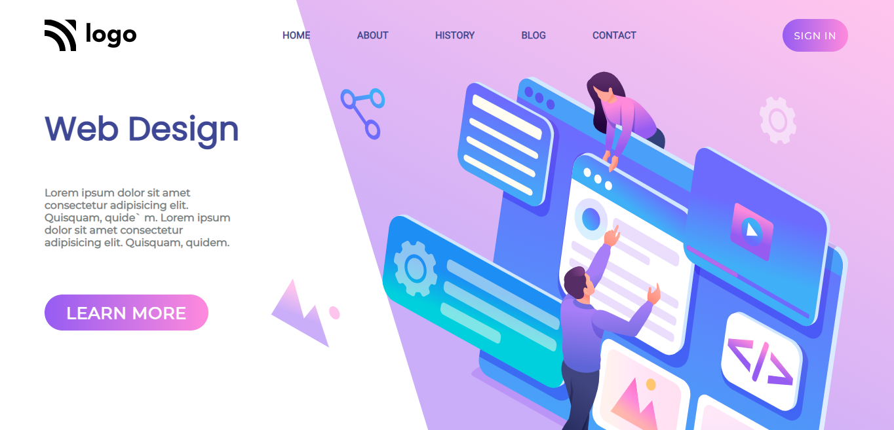

# Eighth Website in pure HTML and CSS

---

## Description
This is a basic landing page designed for a firm in pure HTML and CSS. The overall design is somehow clean and elegant. All the elements and colors used here are of pastel form. Arrangements of the navbar were done using `Flexbox` and its properties. The major issue was with the floating SVG images. Their sizes are getting out of control while making the entire page responsive. The solution to that problem lies behind the width and height properties. The overall time it took to complete this project was around `5-6 hours`. The main CSS was somehow easy but making it responsive took some time and I needed to find the right breakpoint. This project has taught me the value of `Flexbox`, `media queries`, and `image` properties precisely.

---
<!-- 
 -->

<!-- ABOUT THE PROJECT -->

## About The Project

Here's a Screen-Shot of my 8th project along with the code snippets.

 

 

 

 

<!-- PROJECT LOGO -->
 

  

<h3 align="center">project 08</h3>
  
   
    <a href="https://harshal-project08.netlify.app/">View Live Demo</a>
  

## Built With

**Using Technologies**

1. `HTML`
2. `CSS`
3. `MarkDown`

> The challenge of this project was to make the design responsive from scratch with pure CSS without using any frameworks .

 

## Live Project

This project is presently deployed in **`Netlify Service`**.

[Live Project URL](https://harshal-project08.netlify.app/)
 

<!-- LEARNT -->
 

## Learnt
In This project I learnt the following properties of HTML and CSS.
- Flexbox and its Properties.
- In depth learning of Responsive designs.
- Media Queries.
- Use of third party icons (svg).

 
<!-- CONTACT -->

## Contact

- **Name 👨‍💻:** [Harshal Verma](https://github.com/harshalvrm)
- **Email 📧:** [harshalvrm3@gmail.com](mailto:harshalvrm3@gmail.com)
- **Linkedln 📝:** [Click Here](https://www.linkedin.com/in/harshalvrm3/)
- **Blog 📝:** [Hashnode blog](https://xadai.hashnode.dev/)

 

[Project 8 Link](https://harshal-project08.netlify.app/) 

